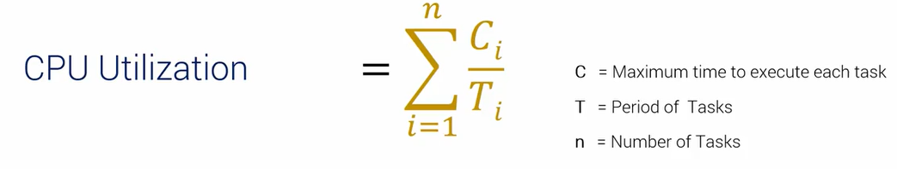

<h1><summary> RTOS </summary></h1>
<details>

<h2><summary>2.Internals of A Real-Time Kernel on ARM Processors</summary></h2>
<details>
Using Keli C to practice this course
Using stm32f411VET board
Oke now u want to run a pin, we have to config like below:
- Enable clock access to Port of the PIN
- Set the Pin's mode
- Set output

**Next**
Ok now u want to LED in Port D12 lighting
- First go to the datassheet stm32f411vet, find the bus clock point to PORTD and have to enable this bus via its register. With Port D, enable AHB1 100mHZ
Now we will open reference manaul and find AHB1 and can see that it in RCC register

```C
/* stm32f411vet board
PD12 - green
PD13 - orange
PD14 - red
PD15 - blue
*/
    /*enable clock for PORT D*/
    RCC -> RCC_AHB1ENR |= 1<<3;
```
- Second we have to select pin for PortD -> search for GPIO register
    + config I/O direction mode in GPIOx_MODER and now if want to set PD12 or PD13 or PD14 or PD15, have to enable bit similar from 24 to 31 and we can see that 01: is output so we have to bit 01 in the MODER similar.
    + next setup high and low mode of pin -> GPIOx_ODR.

- Được rồi đến phần này ta sẽ dùng tiếng Việt khi nói về SystickTimer. System tick là bộ đếm trong core luôn nên nó sẽ ứng dụng nhiều trong RTOS vì nó sẽ phản hôig nhanh với core. Ngoài ra sẽ có 1 số timer khác nhưng nó không nằm trong core như timer 1,2 ..,RTC, watchdog timer. Điểm khác nhau cơ bản của các loại timer:

    + RCC: Reset and Clock Control dùng để quản lý toàn bộ clock system bằng việc chọn nguồn clock và điều chỉnh tốc độ xung, bật tắt các thiết bị ngoại vi như GPIO, UART, TIM, RTC,.. Có thể nói RCC sẽ cung cấp toàn bộ hệ thống clock cho các thiết bị kể cả các General Timer, RTC, Watchdog thì cũm do RCC phân phối nguồn clock. Nhưng mà vẫn cầm các bộ đếm bên trên vì RCC chỉ là người phân phối điều chỉnh chứ không biết đếm.

    + Systick dùng cho hệ thống core và nó sẽ có hàm systick handler riêng để tạo ra ngắt đếm. Nhưng vẫn sẽ phải phân bổ dựa vào RCC, bus clock của Systick là HCLK dựa vào tài liệu rm0383-stm32f411xce thì nó vânx phải lấy từ các nguồn HSI, HSE, PLLCLK rồi nhờ RCC để phân bổ.

    + General Timer: sử dụng linh hoạt có thể đếm hoặc tạo xung pwm. Đặc điểm nổi bật của Timer là có thể tạo ngắt đếm, nên sẽ sử dụng thường xuyên cho các ngoại vi. Bus clock của bộ Timer sẽ là APB1 hoặc APB2 và 2 đươngs bus này sẽ phụ thuộc vào sự phân bổ của RCC mà lấy nguồn từ HSI, HSE hoắc PLLCLK. Và sau khi chọn xong bus hệ thống thì nó sẽ được gọi là SYSCLK 100mhz max.

    + Watchdog Timer: là 1 ngoại vi riêng biệt tức là nó sẽ hoạt động độc lập ngay cả khi CPU bị lỗi, bị treo. Và nó có tác dụng đếm ngược lại để reset hệ thống nếu chương trình bị treo. Watchdog Timer có clock riêng IWDG(Indep WDG) với clock LSI, rất quan trọng trong hệ thống an toàn.

    + RTC: Real Time Clock như cái tên thì nó là bộ đếm thời gian thực tức là khi mình tắt con vi điều khiển thì nó vẫn sẽ hoạt động để đếm -> thường ứng dụng trong đếm đồng hồ giây - phút - giờ. Bus clock của RTC là LSI 32kHz, LSE 32.768kHz

- Vấn đề đặt ra khi ta chạy code muốn 2 chương trình Orange_main và Blue_main cứ 1s đèn nháy kiểu gì. Thì ta không có cách nào khác ngoài việc OS chúng cả tức là cho chúng chạy // với nhau cứ 1s lại nhảy vào 1 chương trình. Và làm sao để làm được thì ví dụ khi ta tạo 1 while(1) trong hàm Orange_main hoặc Blue_main thì nó cũm mãi không thoát ra được thì phải cần 1 thứ gì đó trung gian, thì như ta được biết stack frame trong phần cứng luôn hoạt động, tức là nơi ram sẽ lưu giữ liệu trong quá trình chạy, và ở đó có 1 con trỏ pc sẽ trỏ tới dòng lệnh tiếp theo khi thoát khỏi hàm. Tức là khi 1 quá trình function call hay 1 interrupt xuất hiện các dữ liệu sẽ được lưu tạm vào trong stack và khi kết thúc hàm nó sẽ lấy dữ liệu từ stack ra để tiếp tục. Từ đó ta sẽ lấy dữ liệu từ con trỏ pc cứ 1s thì ta lại đổi con trỏ pc thành hàm blue hay orange như vậy, sẽ tạo thành 1 vòng lặp. Còn stack frame đọc kĩ hơn ở trong coretex document. Xem kĩ hơn trong video ấy ở folder 2.
- Như ta đã nói ở bên trên việc làm sao để chuyển đổi các hàm với nhau và ta đi tới kết luận là sử dụng con trỏ pc và thay đổi nó để nó chạy tới function khác. Nhưng điều đó sẽ dẫn tới việc chương trình chạy không đúng tức là nó sẽ không được chạy về lại nơi nó đã tạo ra ngắt, vì đây là chương trình đơn giản, nhưng nếu vào chương trình lớn nó có thể gây ra lỗi. Vậy nên chúng ta phải tạo ra register riêng cho orange main và blue main thay vì chỉ thay đổi con trỏ pc trong main stack pointer. Và các thanh ghi riêng này sẽ nằm trên RAM - nó là các vùng nhớ ta tự tạo thôi quy trình là ví dụ ta đang làm việc ở orange_main thì trước khi chuyển task ta sẽ lưu từ top stack pointer vào vùng nhớ oragne_main[40]. Và sau đó stack pointer sẽ lấy hết các giá trị từ vung nhớ blue_main[40] và bắt đầu chạy blue_main() dựa vào con trỏ pc mà blue_main[], tương tự khi chuyển về orange_main. 
    + Ở đây có thuật ngữ context chính là dữ liệu của các thanh ghi CPU được lưu vào trong Stack và sau đó sẽ sao chép dữ liệu từ Stack về vùng nhớ đệm như orange_main[40] hay đó là 1 thanh ghi do mình tạo ra trong chương trình. Và context nó lưu toàn bộ dữ liệu cần thiết để 1 task có thể tiếp tục chạy khi bị ngắt giữa chừng, bao gồm các thanh ghi R0-R12, PC, xPSR. Hoặc Stack Pointer, các biến tạm.


- Và khi ta khởi tạo 1 biến con trỏ sp_blue hay sp_orange nó đã được khởi tạo ngẫu nhiên trên RAM và có kích thước là int[40]. Như trong video khi ta vào hàm orange_main đầu tiên thì mình không nhất thiết phải lưu thanh ghi trước khi vào, vì mình không có sử dụng, nên cứ thế nhảy vào thôi. Ngoài ra các cái giá trị R1-R12 gì đó thì nó sẽ được tự cập nhật trong thanh ghi chính khi mình chạy nên cũm không phải lo lắm. Thêm nữa thanh ghi LR nó sẽ chỉ cập nhật khi nhảy vào hàm khác và nó sẽ sử dụng khi mình thoát khỏi hàm, đối với ứng dụng như trong chương trình thì nó ở trong vòng lạp while(1) nên không thể thoát khỏi hàm -> LR không bị bắt buộc cho giá trị thỏa mái. Và khi nó nhảy vào hàm DelayS() chẳng hạn thì LR nó sẽ cập nhật, nói chung là có while(1) thì cái LR mình khởi tạo kia nó không bao h bị gọi đến luoon.


**Code the knowleadge**
```C
#include "stm32f4xx.h"

#define GREEN           (1U<<12)
#define RED             (1U<<14)
#define ORANGE          (1U<<13)
#define BLUE            (1U<<15)

#define GREEN_BIT       (1U<<24)
#define ORANGE_BIT      (1U<<26)
#define RED_BIT         (1U<<28)
#define BLUE_BIT        (1U<<30)

#define GPIOD_CLOCK     (1U<<3)

uint32_t orange_stack[40]; // tao register save tien trinh cho orange_main()
uint32_t blue_stack[40]; // tao register save tien trinh cho blue_main()

uint32_t *sp_orange = &orange_stack[40]; // tao stack pointer cho orange_main()
uint32_t *sp_blue = &blue_stack[40]; // tao stack pointer cho blue_main()

volatile uint32_t tick;
volatile uint32_t _tick;


void GPIO_Init(void);
void DelayS(uint32_t seconds);
void blueOn(void);
void blueOff(void);
void OrangeOn(void);
void OrangeOff(void);
int blue_main(void);
int organe_main(void);
int main(){
    GPIO_Init();
    
    /*Stack for orange_main thread*/
    *(--sp_orange) = (1u<<24) /*xPSR 1<<24 là ở trong thanh ghi 32 bit bit thứ 24 là bit chế độ thumb mode*/
    *(--sp_orange) = (uint32_t)&organe_main; /*PC*/
    *(--sp_orange) = 0x0000000DU /*LR - là thanh ghi trả về kiểu mode như thread mode .. có hẳn 1 page trên rm nói về các giá trị nó sử dụng - ở đây mình fake giá trị khi mới đầu khởi tạo*/
    *(--sp_orange) = 0x0000000DU /*R12 - fake value vì khởi tạo lần đầu*/
    *(--sp_orange) = 0x0000000EU /*R3 - fake value vì khởi tạo lần đầu*/
    *(--sp_orange) = 0x0000000AU /*R2 - fake value vì khởi tạo lần đầu*/
    *(--sp_orange) = 0x0000000DU /*R1 - fake value vì khởi tạo lần đầu*/
    *(--sp_orange) = 0x0000000AU /*R0 - fake value vì khởi tạo lần đầu*/


    /*Stack for blue_main thread*/
    *(--sp_orange) = (1u<<24) /*xPSR 1<<24 là ở trong thanh ghi 32 bit bit thứ 24 là bit chế độ thumb mode*/
    *(--sp_orange) = (uint32_t)&blue_main; /*PC*/
    *(--sp_orange) = 0x0000000DU /*LR - là thanh ghi trả về kiểu mode như thread mode .. có hẳn 1 page trên rm nói về các giá trị nó sử dụng - ở đây mình fake giá trị khi mới đầu khởi tạo*/
    *(--sp_orange) = 0x0000000DU /*R12 - fake value vì khởi tạo lần đầu*/
    *(--sp_orange) = 0x0000000EU /*R3 - fake value vì khởi tạo lần đầu*/
    *(--sp_orange) = 0x0000000AU /*R2 - fake value vì khởi tạo lần đầu*/
    *(--sp_orange) = 0x0000000DU /*R1 - fake value vì khởi tạo lần đầu*/
    *(--sp_orange) = 0x0000000AU /*R0 - fake value vì khởi tạo lần đầu*/
    while(1){
        
    }

void GPIO_Init(void){
    /*Set clock for PORT D*/
    RCC->RCC_AHB1ENR |= GPIOD_CLOCK;
    
    /*Set pin for PORT D*/
    GPIOD->MODER |= GREEN_BIT | ORANGE_BIT | RED_BIT | BLUE_BIT;
    SystemCoreClockUpdate(); // hàm dùng để cập nhật lại biến toàn cục SystemCoreClock vì mình không biết giá trị của bus clock cấp cho core hiện tại là bao nhiêu nên phải update.

    SysTick_Config(SystemCoreClock/100u); /* nếu chia 1000 sẽ tạo ra 1ms ngta để 100 để tí mình nhân 100 để ra giây*/

    /* nói lại cách tính system clock thường = 72Mhz <-> 72_000_000
    -> 72_000_000 / 1000 = 72_000 mà Systick sẽ đếm từ 72_000 đến 0, mỗi xung mất 1/72_000_000 giây (tức là mỗi lần đếm sẽ đếm từng đây và sẽ đếm đến 72_000 lần rồi dùng lại) -> 72_000 * 1/72_000_000 = 0.001s = 1ms (logic thông thường thoi).
    */

    __enable_irq(); // enable clock cho system tick

}

void SysTick_Handler(void){ // hàm đã tồn tại từ trước trong core
    ++tick;
}
uint32_t getTick(void){
    __disable_irq();
    _tick = tick;
    __enable_irq();

    return _tick;
}
void DelayS(uint32_t seconds)
    seconds *= 100;
    uint32_t temp = getTick();
    while((getTick()-temp)<seconds){}/* hàm này nghĩa là ví dụ nhiều lúc getTick nó sẽ có giá trị như 5ms chẳng hạn và seconds kia là 100ms và ta sử dụng while getTick()<seconds vậy là sai ròi bởi nó sẽ đếm từ 5ms đến 100ms không đủ. 
    vậy nên biên temp được tạo ra để lưu giá trị của getTick hiện tại ví dụ là 25ms chẳng hạn: temp = 25ms, trong khi đóa getTick() vẫn liên tục đếm nhưng lần này nó đếm đến 100ms thì nó vẫn phải tiếp tục vì 100 - 25 vẫn nhỏ hơn 100 -> getTick() phải đếm đến 125ms -> và 125 - 25 = 100 hàm delay sẽ đúng.
    */
}
void blueOn(void){
    GPIO->ODR |= BLUE;
}
void blueOff(void){
    GPIO->ODR &= ~BLUE;
}
void OrangeOn(void){
    GPIO->ODR |= ORANGE;
}
void OrangeOff(void){
    GPIO->ODR &= ~ORANGE;
}

int orange_main(void){
    while(1){
        OrangeOn();
        DelayS(1);
        OrangeOff();
        DelayS(1);
    }
}

int blue_main(void){
    while(1){
        blueOn();
        DelayS(1);
        blueOff();
        DelayS(1);
    }
}

```

</details>

<h2><summary>3. Introduction to Real-time Operating Systems</summary></h2>
<details>
- Về cơ bản như ta được biết thì hệ điều hành sẽ quản lý tài nguyên, nó sẽ điều khiển phần cứng và lên lịch các tác vụ, bằng cách nó sẽ phần bổ tài nguyên phần cứng cho các tác vụ nhất định. Vậy RTOS là gì ? Như ta thấy Real-time tức là thời gian thực tức là ta sẽ rằng buộc hay đảm bảo về mặt thời gian đối với các tác vụ.
VD: ví dụ như các chương trình trên window chăngr hạn nếu ta không tắt thì chương trình cũm sẽ không bao h tắt kể cả lỗi, và nếu nó sẽ đứng yên thế luôn. Còn với Real-Time thì 1 một chương trình sẽ chạy trong 1 time nhất định rùi chạy đến chương trình khác.
- Có 2 đặc điểm chính của RTOS là:
    + Thời gian(Deadline): Để tính toán xem liệu rtos có đưa ra kết quả đúng trong 1 thời gian nhất định không, kiểu chạy càng lâu thì không biết nó có sẽ đảm bảo về mặt time hay không ?
    + Độ tin cậy(Reliability): Ước tính độ tin cậy liệu rtos đang chạy ổn định và theo đúng với phản hồi được đảm bảo không ?
</details>

<h2><summary> 4. Software flow </summary></h2>
<details>
Watch video. Nói chung nó nói về flow của 1 chương trình.
</details>

<h2><summary>5. The Stack</summary></h2>
<details>
Watch video. Giới thiệu về stack, vị trí của Stack
</details>

<h2><summary> 6. Overview of Cortex-M OS Support Feature </summary></h2>
<details>
- Trong CPU có rất nhiều thành phần như NVIC, BUS Interface ... nhưng ta chú ý tới 2 bộ phận chính là Control Unit(CU) và Arithmetic Logic Unit(ALU) trong ALU sẽ có các thanh ghi cứng để tính toán các dữ liệu
    + Thanh ghi (Registers): R0 - R15 với R13 là SP(Stack Pointer) có MSP và PSP, R14 LR (Link Register), R15 Program Counter (PC)
    + Ngoài ra còn 1 số thanh ghi đặc biệt(special registers) không nằm trong register bank, nos bao gồm PSR (x3 loại) - trạng thái chương trình và ngắt, PRIMASK - chặn toàn bộ ngắt(trừ NMI), FAULTMASK - chặn luôn cả fault, BASEPRI  - Ưu tiên mức ngắt tối thiểu được phép, CONTROL - đổi chế độ Thread/Handle mode, stack pointer. Và các thanh ghi này mình không thể dùng lệnh load thông thường mà phải dùng câu lệnh assembly cho các thanh ghi này (MSR và MRS instruction). Còn vị trí của thanh ghi này nó sẽ nằm cạnh register bank. Giờ ta sẽ nói về thanh ghi PSR - có 3 loại là sao? Nghĩa là trong thanh ghi 32 bit ấy chia làm 3 phần Application PSR (bit 26-bit 31), Interrupt PSR (bit 0 - bit 8), Execution PSR (có thể là các bit còn lại) về chức năng của từng bit đọc kĩ hơn phần 2.3.2 trong document cortex_m3.

- Operation Mode: trong arm core có 2 modes và có 2 trạng thái operation, cũm như là processor có 2 trạng thái truy cập là privileged và unprivileged(user) access level. 

    + Thì với privileged thì ta được phép truy cập vào toàn bộ hệ thống, còn unprivileged thì khả năng truy cập vào các thanh ghi bị giới hạn như không truy cập được vào các vùng nhớ mà mpu không cho phép, hoặc các câu lệnh hệ thống đặc biệt (như thay đổi vector table), hoặc không chuyển đổi được các chế độ (thread mode, handle mode).

    + Tiếp theo thì arm cortex sẽ có 2 operation state là thumb state và debug state, với thumb state thì tức là nó sẽ là chương trình bình thường khi chạy 16 bit hoặc 32bit (halfword align Thumb and Thumb-2 instruction). Còn đối với debug state thì cta sẽ dùng chương trình lại và chạy chế độ debug thoi. Cụ thể thường thì ta ở trạng thái thumb state tạo 1 cái debug request và nó sẽ nhảy vào debug state khi debug xong sẽ trở lại thumb state.

    + Tiếp theo trong thumb state có 2 operation mode là thread mode và handle mode. Nôm na thì thread mode sẽ là khi chương trình trong hàm main, còn handle mode là khi chúng ta vaò trong hàm ngắt. Với handle mode thì sẽ luôn sử dụng privileged access, còn thread mode sẽ có thể vừa privileged access hoặc unprivileged access. Việc có những mode, state và các quyền truy cập này nhằm việc phát triển firmware tách biệt với phần application. Tức là phần OS sẽ có thể priviledge access, có đầy đủ khả năng truy cập vào thanh ghi, còn với người dùng user lớp application sẽ chỉ truy cập được vào unpriviledge access bằng việc đó thì khi application bị lỗi thì phần OS vẫn có thể chạy bình thường mà không bị ảnh hưởng.

- The Shadow Stack Pointer: tức là một chương trình như ta được biết sẽ có 2 stack pointer và 2 stack frame đó là main stack pointer và process stack pointer. Và main stack pointer thường hay sử dụng cho os Kernel và interrupt vì handle mode luôn sử dụng main stack pointer (hay sẽ luôn sử dụng privilegde access), còn với process stack pointer sẽ phù hợp sự dụng với các tasks. Nhưng với các chuong trình đơn giản ta hay sử dụng các task trong thread mode (tức là chương trình main) sử dụng với main stack pointer, nên là để tối ưu với mục đích sử dụng, phân chia rõ chương trình OS và Task, ta sẽ thay đổi main stack pointer sang process stack pointer ở chế độ thread mode.
+ Để chuyển chế độ từ main stack pointer sang process stack pointer ở thread mode ta phải truy cập vào thanh ghi CONTROL ở Special Register. Với bit số 1 luôn mặc định ở main stack pointer, và nên ta phải ghi thêm 1 để sang chế độ process stack pointer. Và với các Special Register ta phải sử dụng các Instructions như MRS và MSR.

- SVC Exceptions: đầu tiên ta sẽ dựa theo bài giảng thì SVC allows application tasks to gain system level privilege và allows application task to be developed independently of the OS. Ý đầu tiên muốn nói SVC sẽ cho phép application (thread mode - unpriviledge) có thể đạt được gọi là các quyền truy cập hệ thống, tức là có thể truy cập sâu hơn vào thanh ghi các thứ, đấy là khi SVC cho phép chuyển đổi sang priviledge. Ý thứ 2 muốn nói là cho phép application có thể gọi các quyền bên dưới OS mà không cần biết địa chỉ của nó như nào, để nói kĩ hơn ta sẽ trình bày bên dưới
    + Khi ta gọi 1 SVC #number thì nó sẽ nhảy vào SVC handler và cái SVC handler này sẽ do người khác viết và tầng application trên thực tế ở đây chỉ gọi cái SVC #number kia thoi. Nên do đó việc được phép chuyển đổi thành priviledge thông qua CONTROL register cũm phải phụ thuộc vào người viết SVC_Handler có cho phép bạn chuyển đổi hay không, chứ không phải cứ gọi là được.
    + Okee nói về cách thức hoạt động và vì sao dùng SVC ? Thì cơ bản khi mình đang ở chế độ thread mode và unpriviledge thì với chế độ này ta không được phép truy cập vào thanh ghi CONTROL register. Nên ta phải chuyển nó về chế độ priviledge và SVC handler chính là 1 cái Interrupt hay Exception. Tức là khi chúng ta gọi SVC #number là nó sẽ tạo ra 1 Exception. Nó khác với các Interrupt hay Exception khác ở chỗ là nó có thể gọi ra ngắt thay vì phải chờ như Timer hay chờ 1 sự kiện như ngắt GPIO. Vậy nó có thể gọi những gì và khi nào nhờ được nó? Ví dụ khi ta không dám hoặc không thể tự ghi vào RCC để thay đổi clock thì SVC đổi giúp, hoặc không thể reset hệ thống trực tiếp -> gọi SVC yêu cầu system reset, hay cần truy cập vùng flash đã bảo vệ -> gọi SVC để hệ thống kiểm tra và cho phép ... 

- Coding Creating SVC Services: 

    + SVC_Handler() -> Run SVC service -> Determine SVC number -> Read PC register -> Read Link Register: Có thể nói là nó sẽ thực hiện như sau khi gọi lệnh SVC, thì có thể nói SVC service nó sẽ chuyển từ thread mode sang handler mode. Tiếp theo determine SVC number thì chính là đọc cái number mà mình truyền cho SVC và lấy số đó để quyết định được nummber mà mình phải thực thi. Ngoài ra còn đọc PC register - dùng để đọc vị trí khi thoát ra khỏi SVC_handler thoi thì theo ông ấy giải thích trong video khá là khó hiểu, khi mà masking out unwanted bits - cái này có nghĩa là ta đều biết là chương trình ta đều chạy theo số chẵn hay aligned là nhảy 4byte hoặc 2 byte (32bit hoặc 16bit), nhưng cta cũm có cái thumb instruction set tức là các địa chỉ sẽ cộng thêm 1 để nói rằng nó đang ở chế độ thumb (vd: 0x08000201) vì vậy ông ấy nói mask unwanted bits tức là clear cái bit 0 từ 1 thành 0 để lấy cái địa chỉ thật. Ngoài ra ông ấy còn bảo we want to one that has the useful information, tức là ông ấy muốn lấy cái địa chỉ PC để lấy 1 cái thông tin gì đó nữa - thì nó chính xác dùng để -2 byte để đọc opcode của lệnh SVC để lấy cái number kia kìa, vậy tại sao lại là 2byte vì cái con trỏ PC nó nhảy sang dòng lệnh tiếp rồi, nên phải trừ đi 16bit để quay lại cái địa chỉ nó có dữ liệu, SVC là 1 lệnh 16bit trong thumb instruction set. Rồi từ opcode đó lấy ra 8 bits cuối sẽ lấy được SVC number (SVC #0x25 tương đương với opcode = 0xDF25) với DF là mã lệnh của SVC và 25 kia là tham số truyền vào thoi. Tiếp theo read link register là ta sẽ đọc để trả về thread mode hay handler mode cũm như dùng MSP hay PSP, Stack Frame tiêu chuẩn hay extended và cái giá trị này sẽ khá đặc biệt như 0xFFFFFF09. Và làm sao để biết là ta trả về PSP hay MSP thì ta sẽ đọc Link Register(EXC_RETURN) và để í tới bit số 3 nếu bit[2] = 0 return to process stack, bit[2] = 1 return main stack pointer.

    + Vậy SVC sẽ làm được gì trong RTOS? Thì như ta được biết thread sẽ unpriviledge nên sẽ không thể làm trực tiếp với kernel nên SVC sẽ gọi kernel để thực hiện 1 số task vụ như delay() hoặc tạo task.... đại loại là như vậy.

```C

/*đây là câu lệnh trong arm compiler và nó không dùng được trong C, hay nó được gọi là 1 function atrribute, nó thông báo với compiler là phải xử lý đặc biệt với nó */

int __svc(0x00) svc_service_add(int x,int y);
/*__svc(0x00) sẽ tương đương việc gọi SVC 0x00
__asm volatile ("svc #0x00"); tương đương với câu lệnh như này trong C
và khi gọi như này nó sẽ thực thi như sau:
khi ta gọi svc_service_add(5,7); chẳng hạn thì chương chính sẽ thực hiện SVC 0x00 và nó sẽ nhảy vào SVC_handler chung và trong đấy nó sẽ đọc number 0x00 và nhảy vào điều kiện đó để thực thi câu lệnh liên quan
*/

int __svc(0x01) svc_service_sub(int x, int y);
int __svc(0x02) svc_service_mul(int x, int y);
int __svc(0x03) svc_service_div(int x, int y);

int x,y,z;
int main(){
    x = 1;
    y = 5;
    z = svc_service_add(x,y);

    x = 9;
    y = 2;
    z = svc_service_sub(x,y);

    x = 3;
    y = 4;
    z = svc_service_mul(x,y);

    x = 12, y = 6;
    z = svc_service_div(x,y);
}

__asm void SVC_Handler(void){
    /*TST Rn , Operand2
    Ý nghĩa là thực hiện phép AND giữa Rn và Operand2, nhưng không lưu kết quả, thay vào đó, nó chỉ cập nhật các cờ trong thanh ghi trạng thái (Zero flag, Negative flag nằm ở trong thanh ghi PSRx)
    Vì TST này dùng để trả về trạng thái 0 và 1 nên nó sẽ được lưu ở zero flag, còn nếu nó âm nó sẽ được lưu ở negative.
    )
    */
    TST LR, #4 // 0b 0100 đang đi xem bit số 3 của thanh ghi LR là bit gì để xem là chương trình sẽ trả về process stack hay main stack.

    /*ITE - If then else đây là 1 block điều kiện
    EQ = Equal -> nó sẽ vào check zero flag
    ITE EQ tức là EQ = 1 thực hiện câu lệnh ngay bên dưới
    Còn EQ = 0 thực hiện câu lệnh dưới nữa
    */
    ITE EQ
    MRSEQ R0, MSP // nếu đúng thì lấy giá trị MSP vào R0
    MRSNE R0, PSP // nếu sai thì lấy giá trị PSP vào R0
    B       ___cpp(SVC_Handler_C) // B - Branch là nhảy tới 1 địa chỉ hay lable không cần điều kiện giống như goto.
}
/*với *src_args nạp từ thanh ghi R0*/
void  SVC_Handler_C(unsigned int *src_args){
    unsigned int svc_number;
    /* cái này nghĩa là nó sẽ lấy 2byte thấp của src_args[6] đang trỏ vào pc trong Stack Pointer giải thích bên trên phần code ròi*/
    svc_number = ((char*)src_args[6])[-2];
    switch(svc_number){
        case 0:
            /*giải thích chỗ này thì cũm dễ hiểu thoi, chắc m biết R0,R1 tương đương với 2 parameter nên phải cộng [0] + [1] như kia
            thêm tí khi từ hàm main nhảy SVC_Handler vào thì m sẽ có 1 stack farme gồm parameter của x và y lưu vào R0-R1, đó thì bản chất là cái R0-R1 kia nó sẽ nhảy đến địa chỉ của Stack Frame và lấy x,y vào R0-R1 tương ứng. Xong đến bước MRSEQ R0,MSP thì tức là R0 lấy địa chỉ của thanh ghi MSP, tức là trên thưcj tế R0 có thay đổi như nào :)) thì MSP nó có thay đổi gì đâu vì 2 vùng nhớ này là hoàn toàn khác nhau.
            Đó và khi ta lấy được địa chỉ của MSP rồi, xong ra gắn vào 1 biến nào đó và trỏ tới vùng nhớ MSP để tính toán thay đổi giá trị như bthg thoi. Và khi quay trở lại hàm SVC_Handler nó sẽ lại đẩy MSP lên lại Register Bank để tính toán thoi :)). Ncl như quy trình bhg.
            */
            src_args[0] = src_args[0] + src_args[1];
            break;
        case 1:
            src_args[0] = src_args[0] - src_args[1];
            break;
        case 2:
            src_args[0] = src_args[0] * src_args[1];
            break;
        case 3:
            src_args[0] = src_args[0] / src_args[1];
            break;
        default:
            break;
    }
}

```

- PendSV Exception: người ta có nói Minimize latency experienced my Interrupt Service Routines nghĩa là PenSV sẽ giúp giảm thiểu độ trễ mà các hàm ngắt phải chịu. Tức là như nào thì cái PenSV exception này sẽ có mức độ ưu tiên thấp nhất và nó sẽ giữ cái khả năng chuyển đổi task, tức là muốn chuyển task thì vào PenSV, và khi 1 ngắt xảy ra thì nó cứ làm mấy cái ngắt kia trước rồi chuyển Task sau. Thì việc này sẽ không dẫn tới tình trạng delay ngắt khi ví dụ đang thực hiện ngắt nào đó, tự dưng đi chuyển sang làm task khác thì không ổn vì sẽ gây delay ngắt, nên là ta cứ để thực hiện các ngắt trước rồi chuyển đổi sang task khác sau.
+ Và thằng PenSV sẽ nắm giữ context switching là cái quá trình mình lưu và đẩy dữ liệu stack frame lên stack á. Nói ở phần bên trên ròi, ở phần code đầu tiên. ở ví dụ led_red hay gif gì đấy.

VD về quy trình lần lượt priority sẽ là OS(Systick) - Interrupt - SVC - PendSV và Thread sẽ như sau: đầu tiên Task A sẽ được thực thi (thread), xong ví dụ ta set là cứ 1ms sẽ nhảy vào Systick, thì sau khi thực hiện 1ms ở Task A, thì mình sẽ nhảy vào Systick Handler, và ở trong Systick Handler đó mình sẽ kích hoạt PendSV thông qua thanh ghi, và sau đó mình sẽ nhảy vào PendSV để thực thi qua trình context switching. Và sau đó mình sẽ chuyển qua Task B và ví dụ ở đây sẽ có 1 ngắt thì đang thưc hiện giữa chương trình Task B chẳng hạn thì có 1 cái ngắt xảy ra, đương nhiên theo kiến trúc máy tính nó sẽ lưu hết dữ liệu stack frame của task B đang làm dở, và nhảy vào hàm ngắt, trong hàm ngắt này đang làm dở chẳng hạn thì thời gian Systick đủ 1ms thì nó sẽ lại nhảy vào Systick và ở trong đây mình lại kích hoạt ngắt PendSV nhưng mà  ngắt PenSV có mức độ ưu tiên thấp nên khi thực hiện Systick xong nó sẽ lại nhảy về ngắt, và khi ngắt thực thi xong mới thực hiện ngắt PenSV và đồng thời cũm nhận được dữ liệu Stack Frame của Task B như theo cấu trúc máy tính thui, thì trong PenSV lại xử lý quá trình context switching. Đến tiếp Task C thì mình sẽ không sử dụng ngắt Systick cho task này chẳng hạn mà mình sẽ dùng SVC để gọi PendSV, thì quá trình sẽ thực hiện như sau thì khi ta làm task C có thể là thực hiện xong rồi, mình sẽ gọi 1 cái SVC #number nhằm vào thực hiện PendSV và giờ lại vào PendSV thực thi như bthg thoi.

- Exclusive access instructions: từ này vốn dĩ có liên quan đến việc sử dụng tài nguyên chung 1 cách an toàn, đặc biệt đối với các hệ thống đã luồng multithread hay multicore, tức là trong các lõi Arm nó sẽ có cái instruction là LDREX và STREX giúp ta atomic tức là giam 1 cái biến vào để tránh bị nhiều task khác cùng dùng.
    + Ví dụ ta có 1 biến count global và có 2 task. Task 1 ghi dữ liệu count++ và làm số việc khác bên dưới, còn Task 2 sẽ là lấy dữ liệu từ biến count. Giả sử ta đang định ++ biến count ở task 1 thì chuyển task2 thì nhìn count++ có vẻ đơn giản nhưng để ++ được thì nó phải trải qua 3 instruction LOAD, ghi giá trị và lưu vào RAM. Giả sử như trên nó vẫn mới đang ở bước LOAD giá trị vào thanh ghi mà ta lỡ sang Task2 và lấy vào biến count tiếp thì 1 là nó lỗi compiler, 2 là nếu lấy được biến cao thì cũm là giá trị sai vì ở Task1 biến count này mới lưu giá trị vào thanh ghi chứ chưa cộng lên và trả lại giá trị vào RAM, nên Task 2 đọc RAM lấy giá trị sẽ sai. Thì để tránh sai thì ở C++ hay có kiểu mutex ấy nó sẽ giam các biến hoặc đoạn code mình không cho phép task vụ khác dùng. Còn đối vi điều khiển này ta có thể dụng disable ngắt cái đoạn mình cần làm và lại enable nó lên là chả có gì can thiệp được nhưng nó có thể gây trễ tiến trình ngắt, ngoài ra còn cái trong lõi Arm nó sẽ có instruction LDREX và STREX để thực hiện điều đó.
    + Vậy thì LDREX và STREX là gì? LDREX(Load Exclusive) nghĩa là đọc giá trị từ 1 địa chỉ trong RAM và lưu giá trị đó vào thanh ghi (R0 chẳng hạn) và đồng thời CPU đánh dấu nó là exclusive hoặc là đang được theo dõi. Còn STREX(Store Exclusive) nghĩa là ghi giá trị vào cùng địa chỉ và nó chỉ ghi khi chưa ai chạm vào nó từ lần LDREX. Tức là như nào tức là sau quá trình mình sử dụng LDREX xong thì mình thực hiện tăng giá trị đó lên chẳng hạn, cái STREX sẽ kiểm tra xem có ai khác can thiệp vào địa chỉ đó không, nếu không ai chạm vào thì ghi thành công trả về 0 còn nếu có ai khác ghi vào giữa chừng nghĩa là thất bại sẽ trả về giá trị khác 0. Thì như ta thấy điểm yếu của cái này cũm khá lớn vì nó chỉ kiểm tra xem có ai động vào địa chỉ đấy để trả kết quả sai thoi, nếu trường hợp luôn có 1 task B nào đóa luôn nhảy vào để thay đổi giá trị cái địa chỉ count đúng lúc quá trình mình count++ bên trong LDREX/STREX ở Task A. Thì khi trả về task A cái STREX sẽ luôn trả về giá trị khác 0 tức là việc count++ đã không hoàn tất. Điều đó dẫn tới việc count++ có thể chả bao h được cộng lên, còn việc đọc thì vẫn được nha :)) íi là đọc dell bị ảnh hưởng tới STREX và trả về 0, tức là chỉ thay đổi giá trị bên trong thì lỗi, còn đọc thì dell lỗi. Nhưng vấn đề là :)) dcm ngắt với context switching cũm gây ra lỗi. Vậy giải quyêt như nào :)) thì ta disable và enable ngắt đoạn code đó :)) nghe chán vch.


- Systick Interrupt: ncl dùng để tạo thời gian và nó nằm trong core, 1 bộ đếm của core. Gồm 24bit down counter. Có 4 register quan trọng là:
    + Control and Status Register: use enable and disable Systick.
    + Reload Value Register: dùng để nạp giá trị đếm cho Systick hay period.
    + Curent Value Register: dùng để clear giá trị (là khi mình làm giá trị bất kỳ vào thanh ghi này thì sẽ reset giá trị đếm về 0)
    + Priority Register: dùng để thiết lập priority thoi.
    + Step code: Disable -> Set Period -> Clear Initital Value -> Set SysTick priority -> Enable Systick -> Set clock source -> Enable Interrupt.
</details>

<h2><summary> 7.BOOT Sequence </summary></h2>
<details>
- Là quá trình mình ấn reset trên board, lúc ấy quá trình boot sequence sẽ xuất hiện. Thì như trong video người ta có nói là nó sẽ reset lại tất cả các giá trị trong register. Tiếp theo thì processor sẽ quyết định boot mode, sau quá trình chọn boot mode thì tùy vào boot mode thì cơ bản nó sẽ lấy MSP từ địa chỉ 0x00000000, tiếp theo nó sẽ lấy PC từ địa chỉ 0x00000004. Cái mới ở trong video thì ta có thể thấy là địa chỉ ở 0x00000004 là địa chỉ PC, thì ta vẫn nghĩ nó sẽ nhảy vào hàm main(), nhưng thực tế nó sẽ nhảy vào 1 cái hàm reset_handler() trước và trong cái hàm reset_handler đó sẽ chứa hàm main() và sau đó mình mới nhảy tới main(), ngoài việc gọi hàm main() ra thì trong reset handler nó có thể khởi tạo 1 số quá trình như đẩy dữ liệu từ flash lên RAM dựa vào file startup hoặc linker chẳng hạn. Thêm nữa là như trong video thì cái địa chỉ ở 0x000000004 thì giá trị bên trong nó lẻ thì là do chễ độ thumb mode hoặc arm mode, thì thumb sẽ lẻ, nên là muốn nhảy tới địa chỉ đó thì mình phải làm nó chẵn đã, không là jump tới đó luôn bị lỗi đó.
    + Để rõ hơn mình sẽ xem lại video ở trên youtube về quá trình Booting rồi tổng hợp lại. Thì việc Boot nó sẽ dựa vào các Pin của Boot, thì với BOOT[1:0] với BOOT1 là 0 và BOOT0 = 0 thì nó sẽ boot vào main flash memory. Ngoài ra còn 1 số chế độ khác như boot vào system memory hoặc boot lên SRAM. 
    + Ngoài ra ta còn biết tới bảng Vector Table về cơ bản bảng này nó cơ bản sẽ bao gồm tất cả các ngắt, exception, các offset của ngắt, và còn có initial sp value và địa chỉ đầu tiên của Vector table. Và cái bảng Vector Table này có thể reallocate, tức là phân vùng cho nó ở 1 địa chỉ khác nhờ vào thanh ghi SCB_VTOR. Và cái bảng vector table này sẽ được ghi trong file startup
    + Nói thêm về file startup thì nó sẽ là file như cái tên là khởi tạo, tức là trước khi chạy vào main chúng ta sẽ chạy vào file này trước để khởi tạo các cái hàm exceptions và interrput thì tức là mình sẽ đki cái tên exception hay interrupt cho hệ thống. Ví dụ đơn giản như GPIO_Interrupt thì chỉ gọi tên là 1 cái hàm thì sao mà hệ thống biết được. Thif đương nhiên mình phải đki cho hệ thống cái tên đó, thì file startup nó sẽ là nơi mình đki tên và vector table thì chứa các hàm đó đó, vector table nó nằm ở mảng đầu tiên của file start up luôn. Ngoài ra cụ thể hơn thì ở cái hàm reset_handler kia mình sẽ gửi dữ liệu từ flash lên RAM. Và cái dữ liệu từ flash lên RAM này sẽ dựa vào linker script vì ta có phải copy toàn bộ tất cả các dữ liệu lên RAM đâu, mà ta chỉ copy các vùng cần thiết như .text, .data kiểu kiểu vậy và linker script sẽ là người phân bổ đó.
    + Về Linker script: nó sẽ phân bố ROM bắt đầu ở đâu, RAM bắt đầu từ đâu trên bộ nhớ, vùng .text code hay vùng .data sẽ ở đâu, ngoài ra còn 1 số các symbol nữa như _sdata,_edata cái này có thể xem sau. Thì cái Boot nó sẽ giúp như nào, thì cái boot nó sẽ quy định vùng nhớ bắt đầu ở đâu, còn linker script sẽ là người phân bổ code và dữ liệu, kiểu đâu là vùng .text, vùng .bss.
    + Vậy khái niệm bên trên xong rồi thì quá trình Boot chi tiết sẽ như nào? Thì code của mình được lưu ở đâu là do thằng linker quy định, và thông thường bảng vector table sẽ được allocate ở đầu của vùng flash. Thì ta được biết khi ta BOOT[0,0] mode tức là nó sẽ sử dụng Flash thì vùng này sẽ bắt đầu từ địa chỉ 0x80000000, và cái vùng 0x00000000 sẽ ánh xạ đến cái vùng 0x80000000 đấy, tức là 2 vùng này sẽ có dữ liệu giống nhau đơn giản là vùng 0x00000000 này copy của vùng 0x80000000 kia thoi. Thì khi mà Reset thì thằng VTOR sẽ luôn = 0, và xảy ra quá trình ánh xạ mà con chip khi reset nó sẽ luôn tìm tới địa chỉ 0x00000000 và nó sẽ khởi tạo các thông số dựa vào bằng vector table. Và trong bảng vector table có gì mình đã nói ở trên.
</details>

<h2><summary> 8.Introduction to Threads </summary></h2> 
<details>

- Ncl thread nghĩa là thì ví dụ có nhiều task đó, thì mỗi task sẽ phải có 1 Stack Pointer riêng hay 1 cái Register bank riêng thì mới chạy // được, nhưng như thế thì cần 4 core lận, tốn tài nguyên và không hiệu quả. Thì Thread chính là việc mình chạy 4 task trên 1 core duy nhất thoi. Và đặc điểm của Thread sẽ là không chạy kiểu frequently, kiểu tùy phụ thuộc vào mình thiết lập kiểu gì, có những thread lỗi hệ thống mới nhảy vào.

- Classification of thread (phân loại):
    + Timed Threads: Thì cái này sẽ nói về thời gian được định trong Thread như ta nói ở trên thì có những thread lỗi hệ thống chắc mới được vào, hoặc có những Thread chạy tuần tự 

Sporadic Thread: Thì cái Sporadic Thread thường sẽ không có chu kỳ rõ ràng, chạy khi có sự kiện xảy ra, như ngắt do người dùng, hoặc lỗi hệ thống nhưng cái này nó sẽ bị giới hạn về tần suất thực thi. Tức là ví dụ m có 1 nút nhấn ngắt để nhảy vào 1 hàm Sporadic Thread chẳng hạn thì cái này nó sẽ giới hạn như 1s m mới được nhảy vào 1 lần. Tức là dưới 1s m nhấn thỏa mái nó cũm chả thực hiện lại. Giống như việc count++ thay vì ấn liên tục tăng liên tục thì 1s sau ấn mới có thể tăng.

Aperiodic Thread: đối với Aperiodic Thread thì nó sẽ có thể thực hiện liên tục và thường xuyên nhưng mà nó vẫn cần 1 sự kiện như ngắt để nó xảy ra, kiểu nói nó thực hiện liên tục và thường xuyên vì m cứ gọi là nó thực hiện chả bị giới hạn về thời gian như Sporadic Thread, đấy cũm là điểm khác nhau.

Periodic Thread: còn đối với Periodic Thread thì nó quá đơn giản, nó sẽ kiểu được fixed cứng 1 thời gian nhất định và cứ đến thời gian đó là chạy, như cứ 1s nhảy vào 1 lần chả cần yêu cầu về ngắt, chỉ cân yêu cầu về thời gian.

    + Event triggered Threads: Thì cái này nó nói về các sự kiện ngắt thoi như ngắt flag khi flag triggered chuyển đổi trạng thái 0->1 chẳng hạn thì nó sẽ chuyển đổi thread, và nó xảy ra trong flag nội bộ như cờ ngắt Systick chẳng hạn. Còn input-trigger là các dữ liệu bên ngoài vào như nút nhấn. Còn output-trigger được kích hoạt khi mình gửi dữ liệu hoặc bật tắt đèn thông qua output.

    + Main Threads: thì nó được sử dụng khi ban đầu mình vào, mình khởi tạo các task ở trong main í, rồi sau khi chương trình RTOS mình biết có khác task nào thì nó mới chạy các task đó

- Some Key Term:
    + Non Real-Time: No guarantee of task execution (tức là chả có rằng buộc hay đảm bảo về mặt thời gian)
    + Real-time (Hard Real-Time): Bounded latency, guarantees execution. (độ trễ bị giới hạn, đảm bảo thực thi). Và nó sẽ giống cái quy trình PenSV ấy 
    + Soft Real-Time: Executes on priority basis (tức là nó cũm real-time nhưng dựa vào priority mà priority thấp thì chỉ có ăn cức thoi)
    + Latency: Execution delay
    + Periodic Thread: Runs at a fixed time interval.
    + Aperiodic Thread: Run frequently, runtime cannot be anticipated.
    + Sporadic Thread: Run infrequently or never.
    + Blocked state: waiting state.
    + Run state: meaning thread currently is executed.

</details>

<h2><summary>9. Thread Control Block(TCB)</summary></h2>
<details>

- Thì nếu đọc sơ qua thì cơ bản là cái struct tcb{} này nó sẽ lưu các thông tin của cái Thread của nó (hay task của nó). Thì ví dụ khi nhảy vào PendSV tức là quá trình Context Switching diễn ra thì cái tcb ở Task A sẽ lưu các thông tin của nó lại, còn ở PendSV sẽ lấy tcb ở Task B để run, đó đơn giản vậy thoi. 
- Theo như trong video thì nó sẽ là 1 cái struct chứa những cái thông tin private của thread đó. Và nó sẽ bao gồm:
    + Bắt buộc phải có sẽ là: Pointer to stack và Pointer to the next thread.
    + Ngoài ra còn có: Variable to hold thread status, Variable to hold thread ID, Variable to hold thread Period, Variable to hold thread Burst time, Variable to hold thread Priority, ...

```C
struct tcb{
    uint32_t *stackPt;
    struct tcb *nextPt;
    uint32_t status;
    uint32_t Period;
    uint32_t burstTime;
}
```

**Implementing a Thread Control Block:**

- Về cơ bản nó sẽ là như này và mình phải giải thích tại sao lại có những dòng code này trong quá trình RTOS. Ví dụ dưới đây là 4 task
```C
// Giải thích code ở dưới phần code
#define NUM_OF_THREADS      4
#define STACKSIZE           100
struct tcb{
    int32_t *stackPt; 
    struct tcb *nextPt;
}

typedef struct tcb tcbType;
tcbType tcbs[NUM_OF_THREADS];
tcbType *currentPt;
int32_t TCBs_Stack[NO_OF_THREADS][STACKSIZE];
```
- Tự dưng thấy nó cũm đơn giản :)) int32_t *stackPt kia sẽ lưu stack pointer hiện tại của task của mình khi nó chuẩn bị vào context switching (tức là nó sẽ lấy các cái thanh ghi của register bank vào trong stack frame mà con trỏ int32 *stackPt đang trỏ tới, sau đó nó sẽ cập nhật lại stackPt mới vào TCB). Nói rõ hơn để đỡ lú là ta có Register Bank để thực hiện chương trình và Task A chẳng hạn sẽ có Stack Frame riêng, và khi muốn context switching sang Task B thì phải lưu cái thanh ghi hiện tại là cái Register Bank đấy vào trong Stack Frame gồm 7 cái thông số gì đóa đóa. Đấy xong rồi cái biến int *stackPt kia sẽ lấy cái Stack Pointer vừa được lưu vào Stack Frame của Task A đó. Và làm sao mà Register Bank push vào được thì khi ta vào PendSV từ R0->xPSR nó sẽ tự push vào Stack Frame, và trong handler PendSV(nó sẽ vẫn ở trong PSP - theo chat GPT là vậy :)) còn nếu nó ở MSP thì nghỉ chịu chết dell biết push kiểu gì) mình sẽ phải tự push nốt R4->R11 (tự push bằng cách lấy từ register bank vào cái stack pointer hiện tại thoi) và đến R11 thì top Stack ở đó đó và stackPt = top Stack. 

còn *nextPt sẽ trỏ tới địa chỉ của tcb Task khác, đơn giản là lấy địa chỉ thủ công thôi :)) 
VD: Muốn lấy stack của Task B để context switching
Đầu tiên ta lấy địa chỉ của tcb Task B: TaskA-> nextPt = &TaskB;
Xong chta sẽ cho MSP hoặc PSP: PSP = TaskA->nextPt->stackPt vậy là lấy được stack của Task B thôi.
</details>

<h2><summary> 10.The Scheduler and Scheduling Alogorithm </summary></h2>
<details>

**The Scheduler: Thread has 3 three state**
Trong 1 thời điểm chỉ có 1 thread hay 1 task được thực thi bởi processor. Và cái scheduler này sẽ do mình lập ra, cái độ ưu tiên cũm do mình lập ra giữa các task/thread. Gần tương tự như ngắt, nhưng khác chỗ là ngắt là phần cứng được fixed sẵn trong ISR, còn đây nó sẽ giống như các hàm bình thường và mình lập lịch ưu tiên cho các hàm này thoi. 

- Running: là task/thread mà processor đang thực thi.
- Ready: là những task/thread sẵn sàng chạy nhưng phải đợi task đang ở running chạy xong
- Blocked: là những task/thread đang chờ sự kiện ngắt xảy ra.

Các trạng thái chuyển đổi trong schedular:

- READY-RUNNING: trong quá trình Running, scheduler sẽ gắn next thread đối với các Ready Thread đang trong hàng đợi. Xảy ra khi task running hiện tại thực thi xong, và lấy Task đang đợi tiếp theo để thực thi.

- RUNNING-READY: Xảy ra khi task đang thực thi có độ ưu tiên có độ ưu tiên thấp hơn task trong hàng đợi. Nó sẽ bị chiếm đoạt bởi Task khác và nó phải trở lại Ready Thread để chờ Task thực thi cao hơn thực thi xong rồi nó mới được chạy.

- RUNNING-BLOCKED: Là task đang thực thi đã thực thi xong và vào Block để chờ 1 sự kiện như được gọi ra hoặc 1 ngắt xuất hiện.

- BLOCKED-RUNNING: Là khi 1 task xuất hiện và nó có priority cao hơn cả các task trong running và ready, nó sẽ chạy thẳng vào RUNNING.

- BLOCK-READY: là khi 1 sự kiện xảy ra mà nó có priority thấp hơn RUNNING Task thì nó sẽ vào READY để đợi thoi.

**Process vs Thread:**
- Process tức là 1 chương trình sẽ có vùng nhớ riêng, tức là các process sẽ không liên quan gì đến nhau.
- Đối với Thread thì nó nằm trong process tức là các thread sẽ có vùng nhớ chung, nó chỉ khác mỗi stack thoi. Và cũm có thể nói Thread chính là các task trong chương trình.


**Scheduler Classification:**
Này nó là các phân loại kế hoạch lập lịch như dựa vào thời gian, tính định trước hoặc cách hoạt động. Như trong bài ta có Static Scheduling, Dynamic Scheduling và Preemptive Scheduling, Non-premptive Scheduling.

- Static Scheduling, Dynamic Scheduling: Phân loại theo thời điểm quyết định lập lịch với Static sẽ được lập trước khi compile-time hay trước khi chạy, phù hợp trong hard real-time, nơi mà tính toán thời gian cực kỳ quan trọng. Còn trái lại vói Static là Dynamic thì thời điểm quyết định được thực hiện khi hệ thống đang chạy run-time.

- Preemptive Scheduling, Non-Preemptive Scheduling: Như cái tên thì 1 cái ưu tiên ngắt, 1 cái không ngắt. Với Preemptive thì 1 tác vụ có thể bị gián đoạn bởi 1 tác vụ có độ ưu tiên cao hơn, dùng nhiều trong RTOS. Còn Non-preemptive không ngắt hay là 1 tác vụ này thực hiện xong thì tác vụ khác mới thực hiện hoặc là tác vụ đấy phải tự nguyện mới chuyển sang task khác, vậy nên nó không phản ứng nhanh với tác vụ ưu tiên cao, dẫn tới hệ thống không đồng bộ.

- Các group of classification (nhóm phân loại) dựa vào các phân loại mình nói trên ta sẽ có: Dynamic preemptive algorithms, Static Preemptive algorthms, Dynamic Non-preemptive algorithms, Static Non-preemptive algorithms.

**Preemption:**
Thì í muốn nói thì như nào là preemption ? Là khi OS di chuyển thread từ RUN State về Ready State, tức là khi có 1 ưu tiên ngắt cao hơn xảy ra thì cái thread hiện tại sẽ phải về Ready State. Vậy sao từ Run State đến Blocked State không thể hiện là preemption? Thì cái từ Run State đến Blocked State nó xảy ra khi cái thread này thực hiện xong ròi, vậy có khác dì thực hiện tuần tự đâu, kiểu 1 task xong lại đến task khác. Vậy nên mới bảo preemption scheduling sẽ là RUN State về Ready State. Vậy tại sao OS lại làm như vậy, tạo ra preemption algorithm? Thì Preemption is needed to guarantee fairness(cần để đảm bảo sự công bằng giữa các thread như thời gian chạy và công bằng về độ ưu tiên), Preemption needs an interrupts. Preemption helps meet deadlines (giúp đáp ứng giao hạn cho từng thread).

**Scheduler Criteria (Tiêu chí lập lịch / Tiêu chuẩn):**
Đây là những tiêu chí hay tiêu chuẩn để đo mức độ hiệu quả, cũm như phù hợp của 1 scheduler với hệ thống.

- Throughput nói về số task hoàn thành được trong 1 đơn vị time hay trong 1 khoảng thời gian thực hiện được bao nhiêu task nhưng mà phải là hoàn thành(thông lượng).

- Turnaround time (thời gian hoàn thành): là thời gian mà 1 task thực hiện, từ lúc bắt đầu đến lúc kết thúc (time hoàn thành 1 task này thường không cố định nếu như xảy ra ngắt). 

- Response Time(thòi gian phản hồi): là thời gian từ lúc nó được gọi ra đến lúc nó chạy. Tức là nó được gọi ra ròi đúng không nhưng vì có 1 task có độ ưu tiên cao hơn nên nó phải chờ đến lượt nó chạy. Thì thời gian nó chờ đó chính là response time.

- CPU Utilization: là tỷ lệ phần trăm thời gian mà CPU bận làm việc, so với tổng thời gian hệ thống chạy.

- Wait Time: là tổng thời gian thread nằm trong hàng đợi chờ được chạy.

**CPU Utilization**

Nói về thời gian mà mình sử dụng CPU ví dụ như CPU Speed của hệ thống là 80MHz, mà mình chỉ sử dụng CPU 45MHz -> 45/80 *100 -> 56,25% -> việc này không tối ưu. Và làm sao để tính thời gian mà CPU sử dụng thì có công thức dưới đây.


Thì giải thích thêm về xích ma thì nó sẽ chạy từ i -> n với i ở đây = 1 và biểu thức đằng sau xích ma là sẽ cộng liên tục.

**Sheduler Algorithm Optimization Criteria**
Thì nói về việc điều gì sẽ là tối ưu thì đầu tiên là maximize throughput chắc chắn ròi ta sẽ tối ưu việc chạy cho nhiều task hoàn thành trong 1 thời gian cố định.

</details>
</details>

<h1><summary>1 số câu lệnh Assembly</summary></h1>
<details>

**TST Rn , Operand2**
Ý nghĩa là thực hiện phép AND giữa Rn và Operand2, nhưng không lưu kết quả, thay vào đó, nó chỉ cập nhật các cờ trong thanh ghi trạng thái (Zero flag, Negative flag nằm ở trong thanh ghi PSRx)
Vì TST này dùng để trả về trạng thái 0 và 1 nên nó sẽ được lưu ở zero flag, còn nếu nó âm nó sẽ được lưu ở negative.

**ITE EQ**
If then else đây là 1 block điều kiện
EQ = Equal -> nó sẽ vào check zero flag
ITE EQ tức là EQ = 1 thực hiện câu lệnh ngay bên dưới
Còn EQ = 0 thực hiện câu lệnh dưới nữa
Ngoài ra còn có các ITE NE(Not Equal)-> ktra Zero flag(Z==0), ITE LT(Less Than)-> Ktra Negative flag(N) và Overflow flag(V), ITE GT(Greater Than) -> kiểm tra kết hợp Z,N,V.

</details>

<h1><summary>1 số định nghĩa:</summary></h1>
<details>

**Nếu làm về Embedded truyền thống thì có thể hiểu được như bên dưới:**
+ Background: là chương trình chạy liên tục thường là hàm main hoặc while(1) nó luôn chạy và có thể bị ngắt bất cứ lúc nào bởi các interrupt.
+ Foreground(Interupt Service Routines -ISR): là các đoạn mã chạy khi có sự kiện ngắt xảy ra.

**Nếu làm về OS, đa luồng, event-driven system**: thì ISR là background cũm hợp lý, mà trong course này ta làm về RTOS nên có thể hiểu background sẽ là những tiến trình ngắt.

**Blocking code:**
+ Nghĩa là đoạn code thực thi sẽ chặn đứng toàn bộ chương trình tại đó cho tới khi nó hoàn thành xong. Nói cách khác thì khi code block, CPU không thực hiện được các câu lệnh tiếp theo mà phải chờ câu lệnh hiện tại thực hiện xong thì mới tiếp tục -> gây trễ, lag, giảm hiệu suất. VD: delay(1000); // đợi 1s này là 1 hàm blocking code.
</details>