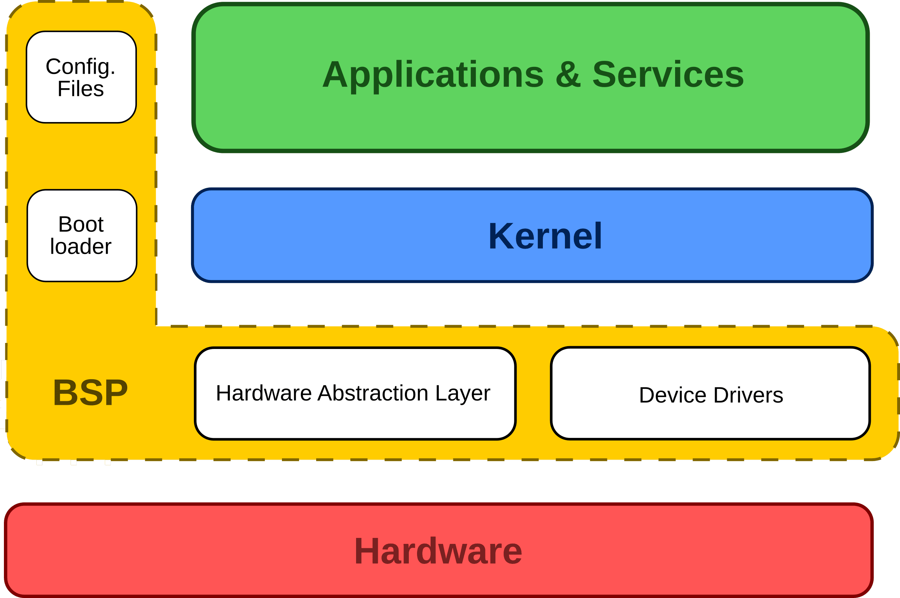
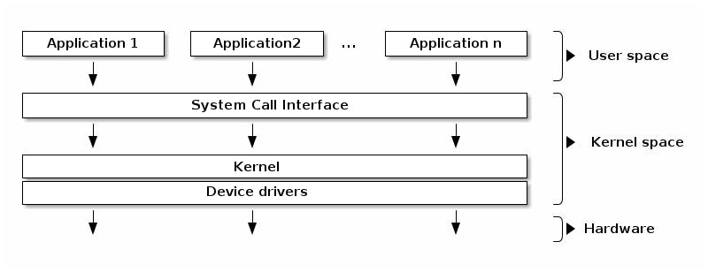

<h1><summary>Tổng quan về Embeeded Linux</summary></h1>
<details>

https://semiconvn.com/home/hoc-thiet-ke-vi-mach/bai-hc-vi-mch/12667-4-thanh-phn-ca-embedded-linux.html

Được ròi theo bài viết trên đây ta sẽ tìm hiểu về toolchain đầu tiên

Trước tiên nói về POSIX không quên thì nó là 1 cái chuẩn được tạo ra bởi IEEE. Nó giống như là 1 cái bản thiết kế các API để cho các hệ điều hành có thể dựa vào đó để tạo ra hệ điều hành. Ngoài ra như nói bên trên thì POSIX sẽ cung cấp 1 số API chuẩn luôn thì người phát triển hệ điều hành cũm không phải viết lại các API đấy như pthread hẳng hạn. Thì nhờ cái chuẩn POSIX này thì 1 ứng dụng có thể dựa vào đó để chạy trên nhiều hệ điều hành chẳng hạn.

1. Toolchain

Thì theo như bài viết thì toolchain là thứ phải quan tâm đầu tiên.
Thì được rùi như ta biết là đoạn code C muốn máy tính hiểu được thì phải chuyển qua dạng nhị phân thì máy tính mới hiểu được, và việc biên dịch đó cần 1 phần mềm gọi là compiler. Ngoài ra trong 1 chương trình C kiểu gì cũm sẽ có tối thiểu là C library hay là thư viện chuẩn của C. Tức là cái thư viện này nó sẽ cung cấp nhiều API để gửi xuống cho hệ thống mà mình không cần phải viết lại mà library này sẽ giúp mình chạy được trên nhiều OS giống như POSIX vậy.

Okee giờ nói về C trên Linux, thì các hàm thư viện C thực chất giống như là 1 cái bản trừu tượng cho người coder đến system call. Do việc system call khá khó để sử dụng và nó cũm không cố định vì mỗi CPU sẽ có 1 cách gọi system call khác nhau. Do đó C library như là 1 cái chuẩn cho coder không phải tác động vào các system call thì ở đây ta sẽ có 1 ví dụ:
```C
#include <fcntl.h>
int main(){
    int fd = open("file.txt", O_ST);
}

/*Trong int open sẽ viết*/
int open(const char *path, int flags){
    return syscall(SYS_open, path, flags);
}

```
Thì ở đây ta có thể thấy thông thường ta làm code C ta sẽ gọi API open() của thư viện C. Thì cái thư viện C tiêu chuẩn này sẽ tác động vào cái system call thật bằng việc gọi 1 cái SYS_Open để cho Kernal biết. Nếu không có API C chuẩn thì ta sẽ phải tác động vào nhân Kernal và điều đó làm ta phải viết nhiều thứ nữa.

Okee nói thêm về các bước chuyển đổi từ C sang mã nhị phân đi thì như ta biêt các ứng dụng từ I/O, Network đều sử dụng thư viện chuẩn C này nên nó gần như là tối thiểu sẽ có. Và các thư viện này sẽ đi kèm với compiler luôn. Thì việc liên kết các thư viện để tạo ra 1 file nhị phân có thể chạy được thì ta sẽ dùng linker để link các cái thư viện chuẩn vào nhau. Và từ file code C như ta được biết nó không chuyển sang mã máy luôn, mà phải qua mã Assembly ròi từ đó mới sang mã máy -> điều đó ta cần thêm 1 Compiler cho Assembly nữa

-> Con người không cần phải trực tiếp viết mã nhị phân cho máy hiểu nên bất cứ phần mềm nào từ bootloader, kernel, rồi lệnh như ls, copy, .. đều phải được biên dịch ra mã nhị phân ròi mới nhát vào máy tính được.

**Vậy Toolchain cho Linux chung là gì?**
Về các thành phần trước thì nó ít nhất sẽ có:
- binutils (công cụ xử lý liên quan đến nhị phân): GNU Assembler, Linker, etc.
- gcc: GNU C Compiler.
- C library (libc): gòm các file header lẫn file binary cho phép ứng dụng giao tiếp với hệ điều hành
- Kernal Headers: thư viện của Kernal
- gdb: Debugger

Đó thì là nó có các thành phần cơ bản mà toolchain có. Ngoài ra nó sẽ có 2 loại toolchain là native và cross chia theo mối quan hệ giữa môi trường nó chạy và môi trường nó sinh ra mã nhị phân:
- Native: tức là nó sẽ kiểu chạy trên máy nào và sinh ra mã nhị phân cho máy ấy luôn ví dụ như kiểu mình viết code C và biên dịch chạy trên máy luôn ấy.
- Cross: tức là chạy trên 1 máy, nhưng sinh ra mã nhị phân cho máy khác. Giống như là kiểu mình chạy code trên lap nhưng mà biên dịch ra file Hex (cho stm32) đó thì tức là tạo ra mã nhị phân cho máy khác đó.
Và Embedded Linux hay dùng Cross Toolchain vì trong các thiết bị nhúng như Arm, RISC-V, v.v thường có kiến trúc khác với máy phát triển như x86_64(Linux, Windowns), và các thiết bị nhúng thường không đủ mạnh để biên dịch trực tiếp (vì việc biên dịch trực tiếp tốn nhiều tài nguyên như cần thư viện cần compiler có sẵn). Nên do đó ta hay kiểu sử dụng các máy phát triển để biên dịch nạp vào các thiết bị nhúng. 

**C Library**
Hay chính là glibc(GNU Library C) ta vẫn thường thấy trên các distro(là bản phân phối của Linux như Ubuntu), thì các cái glibc này thường kèm theo GCC cho Platform tương ứng luôn. Có 3 lựa chọn của thư viện này:
- GNU glibc: đầy đủ chức năng của glibc, nhưng kích thước lớn và chạy cũm tốn (Raspheri Pi 3 dùng bản này)
- GNU eglib: vẫn là glibc nhưng dễ configure hơn, dễ sử dụng ở hệ thống embedded
- uClibc: nhỏ, không được update thư viện liên qun đến thread và các hàm POSIX khác.

Thì bên dưới sẽ nói 1 hồi nữa và quan trọng đến cái phần bootloader ở đây. Thì nó sẽ nói về việc mỗi 1 hệ thống khi bắt đầu sẽ có bootloader. Và công dụng của bootloader sẽ là
- Khởi tạo phần cứng
- Thiết lập bộ nhớ RAM(DRAM)
- Thiết lập bộ xử lý
- Load hệ điều hành bằng cách đọc thiết bị nhớ, từ mạng, từ serial... Và quy load có thể diễn ra nhiều giai đoạn. Như ở đây thì ta có quá trình thực hiện LD1->LD2 ..-> LD N thì gọi chung sẽ là quá trình Booting hay cả đống LD x kia sẽ được gọi là Bootloader. Có bao nhiêu lần load sẽ phụ thuộc vào Platform cũm như Bootloader mà mình sử dụng và khi load đến Hệ điều hành là kết thúc ròi.

Trên Embedded Linux, bootloader được sử dụng phổ biến là Das U-Boot, nó có nhiều chức năng mạnh như:
- Có thể truy cập các hệ thống file phổ biến như: FAT, ext2, ext3, ext4.
- Hỗ trợ cả load kernel qua network
- Hỗ trợ cơ chế truyền tham số cho kernel bằng device tree(cho ARM) khi boot kernel

3. Kernel
Kernel - thành phần quan trọng nhất của hệ thống, chứa bộ lập lịch các tiến trình, quản lý bộ nhớ, quản lý thiết bị..

**Được khởi động từ bootloader**
Binary của Kernel được chứa trong 1 file. File chứa kernel thường có 2 loại là zImage(nén tự giải) và uImage(phần header hỗ trợ việc boot từ Das U-Boot).
Sau khi được load lên địa chỉ bộ nhớ thích hợp, kernel sẽ được khởi động(có thể nó đơn giản chỉ là jump đến địa chỉ main ròi chạy thoi). Trước khi jump đến các tham số khởi động (1 phần từ device tree) phải đươch truyền vào thông qua các thanh ghi.

**Board Support Package**
Để kernel chạy được trên phần cứng, thì phải có BSP
BSP chứa các phần giao tiếp với phần cứng cụ thể đóng vai trò trung gian cho hầu hết các lớp khác của kernel và phần cứng.
BSP có thể main-stream(tức là được tích hợp trong source của nhân Linux) hoặc từ chính các Vendor tạo ra phần cứng (các board) để tạo ra BSP này. Các BSP có thể được cung cấp thêm qua các bản Patch. Để rõ hơn BSP nằm ở đâu ta sẽ nhìn hình bên dưới.



**Kernel Module**
Là thành phần phần mềm được load động vào kernel để chạy. Chạy ở Kernel-space chứ không phải user-space.


Tùy vào cấu hình khi biên dịch kernel mà mỗi module, hoặc nhóm module sẽ được tích hợp sẵn vào bên trong kernel (file zImage hoặc uImage) hoặc được load khi hệ thống đang chạy.

Ứng dụng 

**Quá trình Boot**: thực ra khá là quan trọng

https://viblo.asia/p/linux-boot-process-a-z-1Je5E6XLKnL


**Chức năng của Device Tree**

Vai trò thật sự của Device Tree với GPIO (và phần cứng nói chung)

Device Tree **không điều khiển phần cứng trực tiếp**, nhưng **mô tả phần cứng đó cho kernel** biết:

* GPIO nào được dùng.
* GPIO đó dùng cho thiết bị gì (LED, nút nhấn, UART, I2C, SPI,...).
* Cấu hình của chân đó (input/output, active high/low\...).

> 👉 Dựa trên mô tả này, **kernel sẽ nạp đúng device driver** và **driver sẽ tạo interface (như file trong `/dev` hay `/sys`) để user space có thể tương tác với thiết bị**.

---

📌 **Nói cách khác:**

| GPIO           | Vai trò trong Device Tree | Sau boot sẽ thấy gì?                              |
| -------------- | ------------------------- | ------------------------------------------------- |
| GPIO21         | Dùng cho LED              | `/sys/class/leds/user-led/brightness`             |
| GPIO17         | Dùng cho nút nhấn         | `/dev/input/eventX` (nếu có dùng input subsystem) |
| GPIO3, GPIO4   | Dùng cho I2C bus          | `/dev/i2c-1`                                      |
| GPIO14, GPIO15 | Dùng cho UART             | `/dev/ttyS0`, `/dev/ttyAMA0`, etc.                |

---

📦 Ví dụ mở rộng – Device Tree dùng GPIO cho nhiều thiết bị:

```dts
/ {
    leds {
        compatible = "gpio-leds";

        led1 {
            label = "status-led";
            gpios = <&gpio1 21 GPIO_ACTIVE_HIGH>;
            default-state = "off";
        };
    };

    buttons {
        compatible = "gpio-keys";

        button1 {
            label = "reset-button";
            gpios = <&gpio1 17 GPIO_ACTIVE_LOW>;
            linux,code = <KEY_RESET>;
        };
    };
};
```

👉 Sau khi boot:

* `/sys/class/leds/status-led/...`
* `/dev/input/eventX` được tạo cho nút nhấn

---

 Kết luận

✔️ **Device Tree mô tả từng GPIO sẽ dùng để làm gì**
✔️ **Kernel đọc Device Tree -> nạp đúng driver -> tạo ra device file hoặc sysfs**
✔️ **App user-space chỉ cần làm việc với /dev hoặc /sys, không cần biết chi tiết GPIO số mấy**

---

Nếu bạn muốn, mình có thể:

* ✅ Gợi ý cách debug xem GPIO nào đang được dùng và được ánh xạ như thế nào trong hệ thống Linux bạn đang dùng.
* ✅ Hướng dẫn viết Device Tree đơn giản cho LED hoặc button từ đầu (có thể dùng với qemu hoặc board thực như Raspberry Pi, STM32MP1, i.MX6,...).


</details>